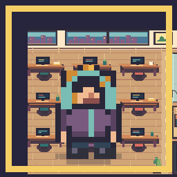
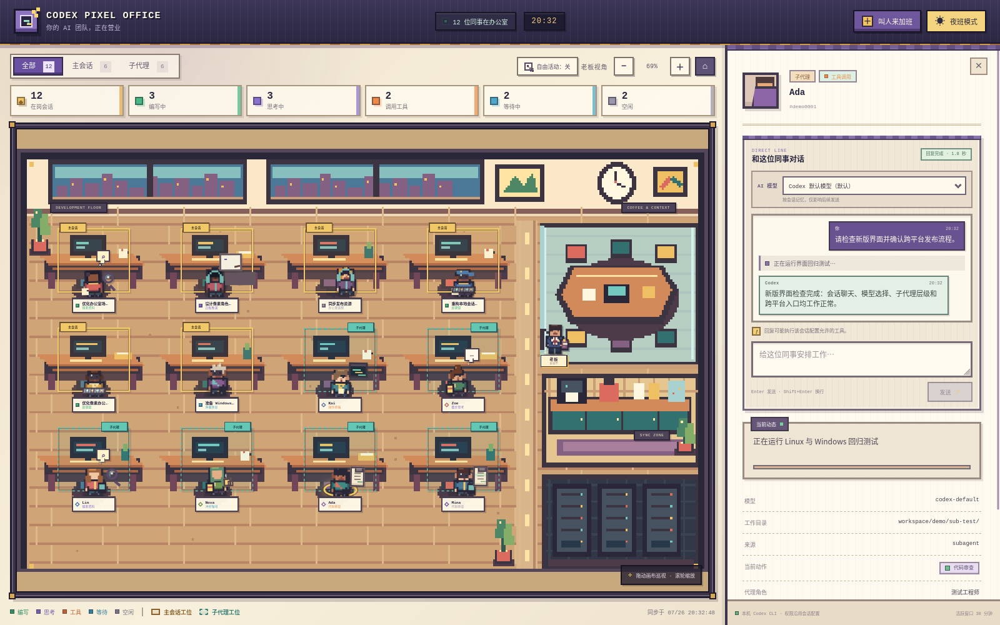
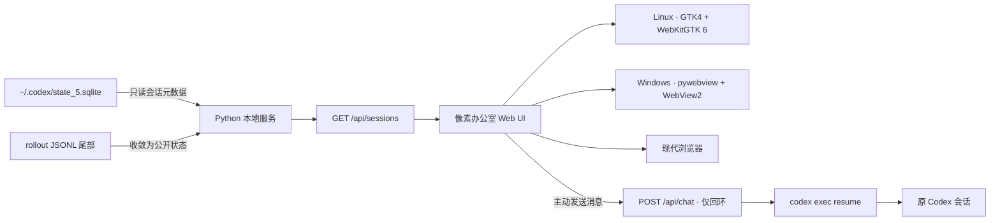

<div align="center">
  
  <h1>Codex Pixel Office</h1>
  <p><strong>把真实 Codex 会话变成一间会思考、协作和工作的像素办公室。</strong></p>
  <p>在一个本地优先的桌面空间里，观察主会话与子代理的实时状态，点击像素员工继续对话，并从老板视角巡视你的 AI 团队。</p>

  <p>
    <a href="VERSION.md"></a>
    
    
    
    
  </p>

  <p>
    <a href="#-快速开始">快速开始</a> ·
    <a href="#-功能亮点">功能亮点</a> ·
    <a href="#-工作原理">工作原理</a> ·
    <a href="#-隐私与安全">隐私与安全</a> ·
    <a href="VERSION.md">版本声明</a>
  </p>
</div>

<p align="center">
  
  
  
  
  
  
  
  
  
</p>

<p align="center">
  
</p>

> [!NOTE]
> Codex Pixel Office 是独立开发的本地工具，不是 OpenAI 官方产品。监控功能只读取本机已有的 Codex 会话状态；模型选择器可能执行一次只读的模型目录查询，只有你在聊天框主动发送消息时才会向 Codex 提交内容并继续原会话。

## ✨ 功能亮点

| | |
|---|---|
| **🏢 实时像素办公室**<br>每 2 秒同步最近活跃的 Codex 会话，让每个会话自动入驻自己的工位。 | **🧭 主会话与子代理层级**<br>主会话使用金色标准工位，子代理使用青绿色紧凑工位，并保留父子关系。 |
| **🎬 状态驱动的角色动作**<br>编写、思考、工具调用、等待和空闲会触发不同动作、气泡和移动行为。 | **☕ 自由活动与老板 NPC**<br>员工可以前往咖啡区、会议区和白板；老板会在会议厅巡视并给出反馈。 |
| **💬 点击员工继续对话**<br>聊天侧栏通过 `codex exec resume` 继续选中的真实会话，并流式显示公开活动摘要。 | **🧠 按会话选择模型**<br>合并 Codex bundled catalog 与本地会话模型，选择结果按会话记忆，只影响后续消息。 |
| **🖥️ 跨平台桌面与浏览器模式**<br>Linux 使用 GTK4 / WebKitGTK，Windows 使用 WebView2，也可通过零第三方 Python 后端在浏览器中打开。 | **🔒 本地优先的安全边界**<br>默认仅监听回环地址，状态数据库只读打开，聊天接口始终拒绝非本机客户端。 |

## 🚀 快速开始

### 前置条件

- Python 3.11 或更高版本，以及包含 `state_5.sqlite` 的本机 Codex 数据目录。
- 如需继续会话或选择模型，需要安装并登录 [Codex CLI](https://github.com/openai/codex)；纯状态监控不要求 CLI 可执行文件存在。
- Linux 桌面模式需要 PyGObject、GTK4 和 WebKitGTK 6。
- Windows 桌面模式需要 Windows 10/11、.NET Framework 4.6.2+、Microsoft Edge WebView2 Runtime，以及 `requirements-windows.txt` 中的 pywebview。
- 浏览器模式的状态面板仅使用 Python 标准库；仓库同时提供 Bash、PowerShell 和 CMD 入口。

> [!TIP]
> Arch Linux 可使用 `sudo pacman -S python-gobject gtk4 webkitgtk-6.0` 安装桌面依赖。Windows 11 通常已经包含 WebView2；若检测不到，可从 [Microsoft WebView2 页面](https://developer.microsoft.com/microsoft-edge/webview2/) 安装 Evergreen Runtime。

### 1. Windows 桌面窗口

推荐双击 `install-windows.cmd` 完成首次安装，或在 PowerShell 中执行：

```powershell
.\install-windows.ps1
```

安装器会选择可用的 Python 3.11+、检查 WebView2 环境、安装 pywebview，并为当前用户创建开始菜单快捷方式。安装完成后可从开始菜单启动，也可随时双击 `run-windows.cmd`。

如果只想从源码运行、不创建开始菜单快捷方式，可以仅安装依赖：

```powershell
py -3 -m pip install -r requirements-windows.txt
```

随后双击 `run-windows.cmd`，或执行：

```powershell
.\run-windows.ps1
```

常用选项：

```powershell
.\run-windows.ps1 --fullscreen
.\run-windows.ps1 --active-minutes 60
.\run-windows.ps1 --codex-home "$env:USERPROFILE\.codex"
```

卸载开始菜单快捷方式使用 `uninstall-windows.cmd`。安装器不会复制源码，移动项目目录后需要重新安装快捷方式。若 Windows PowerShell 因执行策略阻止直接运行 `.ps1`，请优先使用对应的 `.cmd` 入口；企业组策略仍可能要求管理员放行。

### 2. Linux 桌面窗口

在已经获取的项目目录中执行：

```bash
cd codex-pixel-office
./run-desktop.sh
```

常用选项：

```bash
# 全屏打开
./run-desktop.sh --fullscreen

# 展示最近 60 分钟内有更新的会话
./run-desktop.sh --active-minutes 60

# 使用另一份 Codex 数据目录
./run-desktop.sh --codex-home /path/to/.codex
```

安装到 Linux 系统应用菜单：

```bash
./install-desktop.sh
```

安装后，在应用启动器中搜索 **Codex Pixel Office** 或 **Codex 像素办公室**。卸载菜单入口：

```bash
./uninstall-desktop.sh
```

安装脚本不需要 root 权限，只会写入当前用户的 XDG 应用和图标目录，不会复制或移动项目源码。启动器会记录当前源码目录的绝对路径，因此安装后不要随意移动或删除仓库目录。

### 3. 使用浏览器模式

Linux：

```bash
./start.sh
```

默认打开 <http://127.0.0.1:8765>。如果不希望自动打开浏览器：

```bash
CODEX_PIXEL_NO_BROWSER=1 ./start.sh
```

自定义端口或活跃时间窗口：

```bash
CODEX_PIXEL_PORT=9000 ./start.sh --active-minutes 60
```

Windows 可双击 `start-windows.cmd`，或在 PowerShell 中执行：

```powershell
.\start-windows.ps1
```

不自动打开浏览器：

```powershell
$env:CODEX_PIXEL_NO_BROWSER = "1"
.\start-windows.ps1
```

## 🎮 如何使用

1. 在 Codex CLI 或 Codex 应用中开始、继续一个任务。
2. 活跃会话会在下一次同步时自动出现在办公室工位上。
3. 使用“全部 / 主会话 / 子代理”筛选团队，拖动画布或滚轮缩放巡视办公室。
4. 点击任意像素员工，查看模型、工作目录、父会话、当前活动和最近更新时间。
5. 在右侧聊天框发送消息，继续该员工对应的原 Codex 会话。

聊天框支持：

- `Enter` 发送，`Shift + Enter` 换行。
- 每个会话独立保存本次软件运行期间的聊天记录和输入草稿。
- 同一会话同一时间只执行一条消息，避免并发修改冲突。
- 可为每个会话独立选择后续消息使用的模型；聊天记录、草稿和模型选择只保留在当前应用进程内。
- 主题、自由活动开关和固定工位映射保存在浏览器 `localStorage` 中。

## 🚦 状态与动作

| 状态 | 判断依据 | 办公室表现 |
|---|---|---|
| `working` | 正在读取请求、编写回复、处理工具结果或协调代理 | 留在工位敲键盘、阅读或审查代码 |
| `thinking` | 最近事件为推理或方案组织 | 阅读上下文、踱步、白板推演或同步讨论 |
| `tool` | 存在尚未完成的终端、文件、浏览器、MCP 等工具调用 | 留在工位操作终端、检查服务器或搜索资料 |
| `waiting` | 等待用户输入、外部结果、子代理或下一轮任务 | 前往会议区、咖啡区或在工位等待 |
| `idle` | 会话仍在活跃窗口内，但近期没有新事件 | 休息、伸懒腰、喝咖啡、巡视或打盹 |

角色每 8 秒根据会话状态、活动类型、父子关系和稳定随机种子选择一次子动作。编写和工具调用状态始终留在固定工位；思考、等待和空闲状态可在开启“自由活动”后前往公共区域。

<details>
<summary><strong>查看完整动作与反馈机制</strong></summary>

- 工作动作：敲键盘、阅读上下文、代码审查、操作终端、检查服务器、搜索资料。
- 思考动作：踱步、白板推演、同步讨论。
- 休息动作：喝咖啡、伸懒腰、打盹和巡视。
- 事件反馈：新会话入场、休息后复工、错误或审批信号、任务完成庆祝。
- 连续移动：员工会按距离在工位和公共区域间移动；途中状态变化时会从当前位置自然掉头。
- 减少动态效果：尊重系统的 `prefers-reduced-motion` 设置。

</details>

## 🧩 工作原理



后端会以 SQLite 只读模式读取未归档会话，并且每个 rollout JSONL 文件只读取末尾最多 1 MiB。活动分类器只输出经过允许的状态和简短描述，不把提示词、推理正文、完整命令或工具参数发送到界面。

### 运行模式对比

| 模式 | 启动方式 | 额外依赖 | 适用场景 |
|---|---|---|---|
| Linux 桌面窗口 | `./run-desktop.sh` | PyGObject、GTK4、WebKitGTK 6 | Linux 独立窗口、全屏老板视角 |
| Windows 桌面窗口 | `run-windows.cmd` | .NET Framework 4.6.2+、pywebview、WebView2 Runtime | Windows 10/11 原生窗口 |
| 应用菜单 | Linux `install-desktop.sh`；Windows `install-windows.cmd` | 对应桌面依赖 | 从系统应用启动器快速打开 |
| 浏览器 | Linux `./start.sh`；Windows `start-windows.cmd` | 状态面板无需第三方 Python 包 | 开发调试、轻量查看或不安装桌面依赖 |

## 🔐 隐私与安全

> [!IMPORTANT]
> 默认服务只监听 `127.0.0.1`。即使你把状态面板手动绑定到 `0.0.0.0`，`/api/chat` 和 `/api/chat/models` 仍只接受来自本机回环地址的请求。

- `~/.codex/state_5.sqlite` 使用 SQLite 只读连接，并启用 `query_only`。
- rollout 路径必须位于配置的 `CODEX_HOME` 内，防止读取目录外文件。
- 界面只展示会话标题、目录、模型、角色、时间和收敛后的活动类型。
- 聊天输出经过允许列表过滤，不展示隐藏推理、完整命令或工具参数。
- 聊天消息长度、请求体、单行事件和总输出均设置上限。
- 默认限制为单条消息最多 12,000 字符、全局最多 4 条并发聊天、单次最长 10 分钟、总输出最多 2 MiB。
- Codex CLI 的登录状态、审批策略、沙箱和工具权限完全沿用原会话及本机配置。
- 服务不会自动添加绕过审批或沙箱的危险参数。
- 静态资源响应包含 CSP、禁止嵌入、禁用敏感浏览器权限等安全响应头。

> [!WARNING]
> 设置 `CODEX_PIXEL_HOST=0.0.0.0` 会把**没有登录认证和 TLS 的状态面板**暴露给同一网络中的其他设备，其中可能包含会话标题、工作目录和模型信息。只应在可信局域网中使用，绝不要直接暴露到公网。

## ⚙️ 配置

| 配置项 | 默认值 | 作用范围 | 说明 |
|---|---:|---|---|
| `CODEX_HOME` / `--codex-home` | 用户目录下的 `.codex` | 所有模式 | 包含 `state_5.sqlite`、`sessions/` 和 Codex 配置的目录 |
| `--active-minutes` | `30` | 所有模式 | 只显示最近指定分钟内有更新的未归档会话 |
| `CODEX_PIXEL_CODEX_BIN` / `--codex-bin` | `codex` | 所有模式 | 显式指定 `codex.exe`、`codex.cmd` 或其他 Codex CLI 路径 |
| `--fullscreen` | 关闭 | 桌面模式 | 以全屏方式打开办公室 |
| `CODEX_PIXEL_HOST` | `127.0.0.1` | 浏览器模式 | HTTP 服务监听地址 |
| `CODEX_PIXEL_PORT` | `8765` | 浏览器模式 | HTTP 服务监听端口 |
| `CODEX_PIXEL_NO_BROWSER` | `0` | 浏览器模式 | 设为 `1` 时不自动打开浏览器 |
| `CODEX_PIXEL_WEBVIEW2_RUNTIME` | 空 | Windows 桌面 | 指向自带的 WebView2 Fixed Runtime 目录；通常无需设置 |

推荐使用系统安装的 Evergreen WebView2 Runtime。若使用 Fixed Runtime，请自行保证版本不低于 `86.0.622.0`，且目录必须位于本地磁盘而不是 UNC/网络路径；WebView2 120+ 在部分 Windows 10 环境还需要按 [Microsoft 分发说明](https://learn.microsoft.com/microsoft-edge/webview2/concepts/distribution#known-issues-for-fixed-version) 配置 AppContainer 读取与执行权限。

也可以直接运行后端以使用完整命令行参数：

```bash
python3 server.py --host 127.0.0.1 --port 8765 --active-minutes 30
```

## 🔌 本地 API

| 方法 | 路径 | 用途 |
|---|---|---|
| `GET` / `HEAD` | `/api/health` | 查看服务、数据库和聊天能力是否可用；数据库不可用时业务状态为 `degraded` |
| `GET` / `HEAD` | `/api/sessions` | 获取活跃会话、父子关系、状态统计和更新时间 |
| `GET` / `HEAD` | `/api/chat/models` | 获取本机可用 Codex 模型；仅限回环客户端 |
| `POST` | `/api/chat` | 继续指定 Codex 会话并返回 NDJSON 流；仅限回环客户端 |

这些接口面向本机 UI，不承诺在 `v0.x` 阶段保持稳定的公共 API 兼容性。

## 🗂️ 项目结构

```text
codex-pixel-office/
├── desktop_common.py       # 跨平台桌面服务生命周期与冒烟测试协议
├── desktop_app.py          # Linux GTK4 / WebKitGTK 桌面外壳
├── windows_app.py          # Windows pywebview / WebView2 桌面外壳
├── server.py               # 会话解析、本地 HTTP API 与 Codex 聊天桥接
├── static/
│   ├── index.html          # 办公室与聊天侧栏结构
│   ├── styles.css          # 像素 UI、响应式布局与动画
│   ├── app.js              # 会话同步、角色行为、交互与流式聊天
│   └── assets/             # 办公室背景、员工、老板、状态图标
├── packaging/              # Linux Desktop Entry 模板
├── tests/                  # 后端、Linux/Windows 桌面与安全边界测试
├── tools/                  # 像素素材生成工具
├── install-desktop.sh      # 安装当前用户的应用菜单入口
├── run-desktop.sh          # 启动桌面窗口
├── start.sh                # Linux 浏览器模式
├── *-windows.ps1 / *.cmd   # Windows 运行、安装与卸载入口
├── requirements-windows.txt # Windows 桌面依赖
└── VERSION.md              # 当前版本、兼容性和版本策略
```

## 🛠️ 开发与测试

运行完整测试套件：

```bash
python3 -m unittest discover -s tests -v
```

启动开发服务器：

```bash
python3 server.py --port 8765 --open-browser
```

在有图形显示的环境中执行桌面冒烟测试：

```bash
./run-desktop.sh --smoke-test
```

Windows 实机可执行对应的 WebView2 冒烟测试：

```powershell
.\run-windows.ps1 --smoke-test
```

浏览器模式运行时只依赖 Python 标准库。只有重新生成或验证像素素材时才需要 Pillow：

```bash
python3 -m pip install Pillow
python3 tools/make_pixel_assets.py
python3 tools/make_pixel_assets.py --check-only
```

当前测试套件包含 39 项后端与桌面测试，覆盖真实 GTK/WebKit 页面冒烟测试、Windows WebView2 页面就绪协议、`codex.cmd` 命令解析、Windows 进程树清理、代理环境下的回环启动、特殊路径下的只读 SQLite、聊天生命周期、模型目录、输入边界、回环限制、Host 校验和静态路径穿越防护。

## 🩺 常见问题

<details>
<summary><strong>办公室里没有出现任何员工</strong></summary>

确认 Codex 已经创建会话，并检查 `CODEX_HOME` 是否指向正确目录。默认只展示最近 30 分钟内有更新的未归档会话，也可以使用 `--active-minutes 60` 扩大时间窗口。

</details>

<details>
<summary><strong>能看到员工，但无法发送消息</strong></summary>

确认 `codex --version` 可以正常执行且 Codex CLI 已登录。聊天只能从运行服务的本机访问；同一会话已有消息执行时，新请求会暂时被拒绝。

</details>

<details>
<summary><strong>桌面窗口提示没有图形显示或缺少组件</strong></summary>

Linux 请确认当前会话存在可用的 Wayland/X11 图形显示，并安装 PyGObject、GTK4 与 WebKitGTK 6。Windows 请先执行 `install-windows.cmd`，并确认已安装 Microsoft Edge WebView2 Runtime。若暂时不安装桌面依赖，可改用浏览器模式。

</details>

<details>
<summary><strong>Windows 提示找不到 pywebview 或 WebView2</strong></summary>

先从 [Microsoft 官方页面](https://developer.microsoft.com/microsoft-edge/webview2/) 安装或更新 WebView2 Runtime，再运行 `install-windows.cmd` 检查环境、安装 pywebview 并创建快捷方式。应用会拒绝回退到不支持现代前端语法的旧 MSHTML 引擎。

</details>

<details>
<summary><strong>PowerShell 提示脚本被执行策略阻止</strong></summary>

优先双击或从 CMD 运行对应的 `*-windows.cmd`；这些入口会为当前进程使用 `ExecutionPolicy Bypass`。如果设备受企业组策略管理且仍被拦截，请联系管理员，不要长期降低整台机器的执行策略。

</details>

<details>
<summary><strong>Windows 与 WSL 中的会话不一致</strong></summary>

原生 Windows 默认读取 `%USERPROFILE%\.codex`，WSL 默认读取 Linux 用户目录下的 `~/.codex`。请在产生会话的同一环境中运行像素办公室，不建议把另一环境的 rollout 路径直接混用。

</details>

<details>
<summary><strong>端口 8765 已被占用</strong></summary>

Linux 使用 `CODEX_PIXEL_PORT=9000 ./start.sh`；Windows PowerShell 使用 `$env:CODEX_PIXEL_PORT="9000"; .\start-windows.ps1`。

</details>

## 📌 版本与兼容性

当前声明版本为 **v0.2.0 Preview**。完整的支持范围、已知限制和语义化版本规则见 [VERSION.md](VERSION.md)。

项目依赖 Codex 的本机 `state_5.sqlite` 和 rollout JSONL 内部格式。如果未来 Codex CLI 调整这些结构，解析层可能需要同步适配。

## 📄 许可证与品牌说明

当前仓库尚未包含 `LICENSE` 文件。在对外复制、修改或分发前，请先由项目维护者补充明确的许可证。

Codex、OpenAI 及相关标识归其各自权利人所有。本项目为独立工具，与 OpenAI 不存在官方隶属或背书关系。

---

<p align="center">
  <strong>让 AI 团队的工作，不再只发生在看不见的终端里。</strong>
</p>
